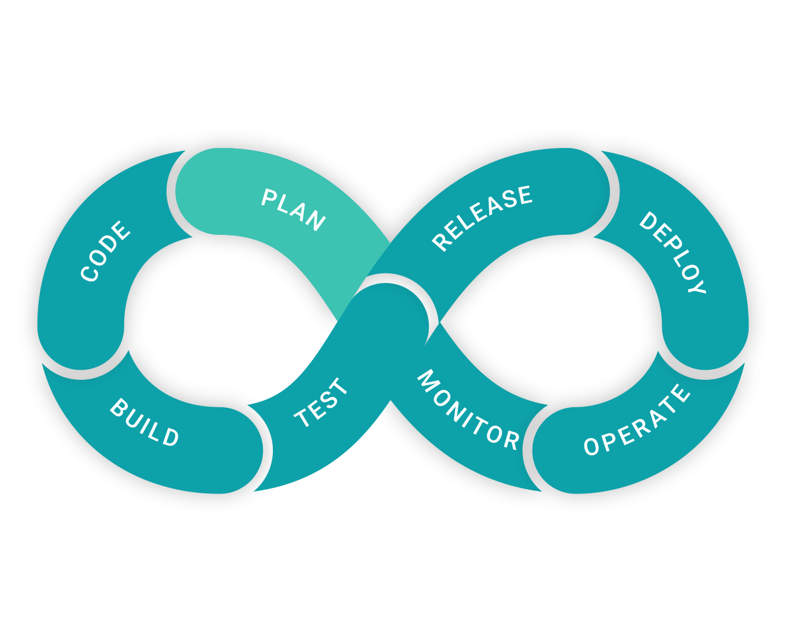

  
   
  

<h1 id="header" align="center">
  Hi there , my name is Sergey Sadchikov.
</h1>

  

---

### :man_technologist: About Me :
I'm a DevOps Engineer :computer:.
- :telescope: I work as a DevOps engineer, support the development, deployment of the product (I run it on a server, hosting) and test its performance, as well as support the environments where 
  the embedded product is located.

- :seedling: Exploring Technical Content Writing.

- :zap: In my free time I do pet projects and read technical articles.

- :mailbox:How to reach me: <a href= "mailto: sadchikovsg@gmail.com"> sadchikovsg@gmail.com </a>

---
### :calling: Connect with me: 
 

---
### :hammer_and_wrench: Languages and Tools :

  &nbsp;
  &nbsp;
  &nbsp;
  &nbsp;
  &nbsp;
  &nbsp;
  &nbsp;
  &nbsp;
  &nbsp;
  &nbsp;
  &nbsp;
  &nbsp;
  &nbsp;
  &nbsp;
  &nbsp;
  &nbsp;
  &nbsp;
  &nbsp;
  &nbsp;
  &nbsp;
  &nbsp;
  &nbsp;
  &nbsp;
  &nbsp;
  &nbsp;
  &nbsp;
  &nbsp;
  &nbsp;
  &nbsp;
  &nbsp;
  &nbsp;
  &nbsp;
  &nbsp;
  &nbsp;
  &nbsp;
  &nbsp;
  &nbsp;
  &nbsp;

---
### :bar_chart: My Stats :

  
  
  
  
  

